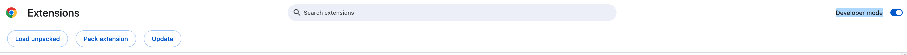
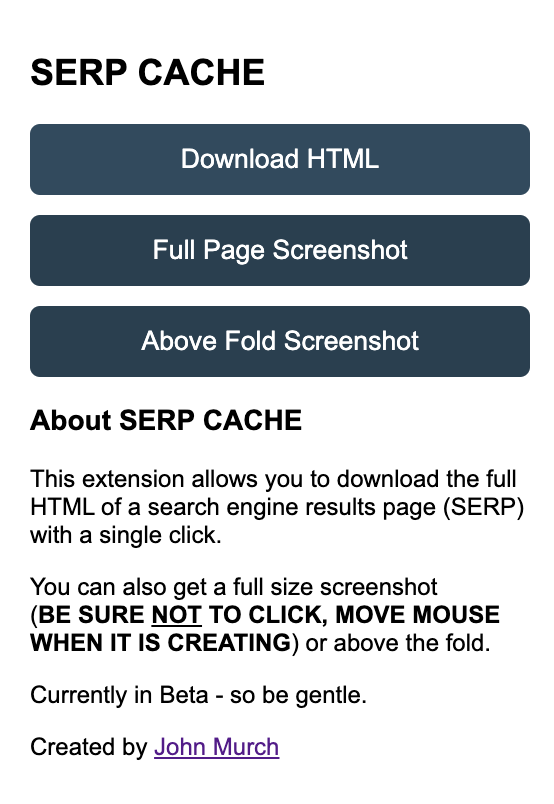

# serp-cache

Chrome Plugin to download SERP html as well as take screenshots

# Setup

1. Download this repo locally as zip and unpack
2. Open [chrome://extensions/](chrome://extensions/) in chrome, be sure to ON Developer mode in top right. Then click Load unpacked - select the folder you just unziped
   

3. Pin Extension
   
4. Open up a SERP
5. Download HTML, Create full page screenshot or above the fold
   

Enjoy!
